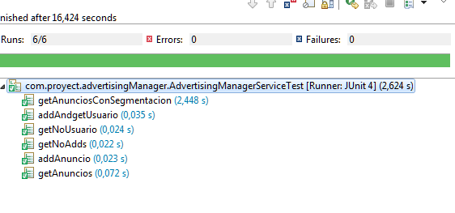
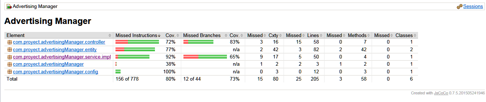

# ADVERTISING MANAGER 
By Javier Martin Gonzalez
Encargado por Valtech

De acuerdo a lo solicitado por parte de la empresa Valtech me propuse aprender cuanta tecnologia estuviera a mano, 
tratando siempre de usar cosas modernas y rapidas, consulte mucho internet y gente conocida para saber cual era lo mejor
de lo que estaba dando vueltas, el resultado a continuacion.

# Tecnologias Utilizadas:

- Java8: El core de la app
- SpringBoot: Api para dar manejo de aplicacion Rest, sencilla, rapida, ideal para el ejercicio en cuestion
- MongoDB: BD No relacional, embebida para este caso, queria darle una vuelta a las BD no relaciones y no defraudo
- Log4j: Logueo
- jUnit: Testing
- Lombok: Ahorro de lineas de configuracion con un par de anotations
- Maven: Librerias
- Swagger: Documentador de API endpoints.
- Jacoco: Cobertura y reportes

# Instrucciones para lanzar la aplicacion en localhost

1) Clonar el proyecto de github (https://github.com/xaavito/adveritising-manager)

2) Una vez clonado en un repo propio basta con ir a la carpeta advertisingManager y desde la consola

					java -jar target/advertisingManager-0.0.1-SNAPSHOT.jar

3) Acceder via explorador a:

							localhost:8080/add-anuncio

							localhost:8080/get-anuncios
							
							localhost:8080/get-anuncios/{id}
							
							localhost:8080/add-usuario

							localhost:8080/get-usuarios
							
							
# Tests

Conexion con Travis que ejecuta los tests y se puede ver en el Badge, Ademas adjutno esta captura de pantalla.

# Coverage

Covertura de codigo a traves de los tests.

# Swagger

!http://localhost:8080/swagger-ui.html#/